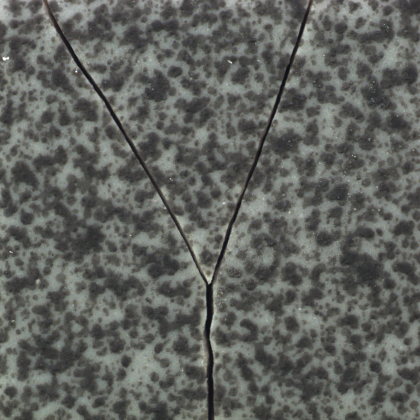

# data
[Baidu Netdisk](https://pan.baidu.com/s/1R2B0iDTz6nuZE7BdaDacSQ)
提取码：8888
```
data
├── test
│   ├── crack
│   ├── glue_strip
│   ├── good
│   ├── gray_stroke
│   ├── oil
│   └── rough
└── train
    └── good
```
# train
```
python abnormalnet.py --type train
```
# auc test
```
python abnormalnet.py --type auc
```
# single predict
```
python abnormalnet.py --type test -i data/test/crack/001.png
```



